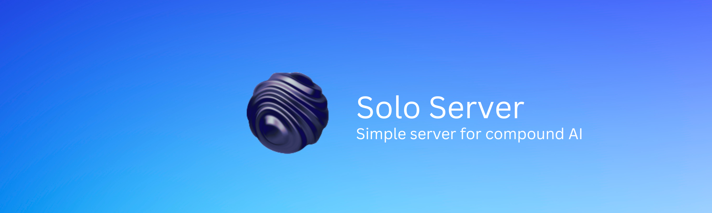

<div align='center'>

# Simple server for compound AI    



&nbsp;

Simple. Private. Effective.    
</div>

----

Solo Server is a flexible and privacy-first server framework designed for hosting AI models locally and securely. Built with on-device model deployment in mind, Solo Server allows you to set up, manage, and serve AI-powered endpoints with ease, whether you're working with language models, computer vision, audio processing, or multimodal applications.

## Features

- **Seamless Setup:** Manage your server and configure settings with CLI.
- **Ready-to-Use Templates:** Pre-built for language models, computer vision, audio, tabular data, and more.
- **Cross-Platform Compatibility:** Effortlessly deploy across any platform.
- **Extensible Framework:** Easily expand to support new AI models and workflows.

## Quickstart


Requires Python 3.8 or higher.

1. Install Core Package

```bash
pip install solo-server
```

2. Start the Server with a Template

```bash
solo-server start llm  # For language model template
solo-server start vision  # For computer vision template
solo-server start basic  # For basic template
```

Your server should now be running at `http://localhost:8000`.

3. Test the Server

```bash
curl -X POST http://localhost:8000/predict \
  -H 'Content-Type: application/json' \
  -d '{"prompt": "What is On Device AI?"}'
```

For API documentation, please refer to [this link](https://github.com/ggerganov/llama.cpp/blob/master/examples/server/README.md#usage).

Solo Server provides several templates to kickstart your project:

- **basic**: A minimal project setup with simple mathematical operations.
- **llm**: Language models using Llama 3.2B Instruct model.
- **vision**: Computer vision using ViT model for image classification.
- **huggingface**: Direct integration with Hugging Face models.
- **compound**: Multi-modal setup combining text, vision, and audio capabilities.


## Tagged Templates

### Language Models
| Model                  | Tagged Template                       | Model Size | Info Link                                                                                                           | Tags                                    |
|------------------------|---------------------------------------|------------|---------------------------------------------------------------------------------------------------------------------|-----------------------------------------|
| LLaMA 3.2 3B Instruct  | Llama-3.2-3B.Q6\_K                   | 2.62 GB    | [See HF repo](https://huggingface.co/Mozilla/Llama-3.2-3B-Instruct-llamafile)                                      | Instruct, LLaMA, 3B, multilingual       |
| LLaMA 3.2 1B Instruct  | Llama-3.2-1B.Q6\_K                   | 1.11 GB    | [See HF repo](https://huggingface.co/Mozilla/Llama-3.2-1B-Instruct-llamafile)                                      | Instruct, LLaMA, 1B, lightweight        |
| Gemma 2 2B Instruct    | Gemma-2-2B.Q6\_K                     | 2.32 GB    | [See HF repo](https://huggingface.co/Mozilla/gemma-2-2b-it-llamafile)                                              | Instruct, Gemma, 2B, Italian            |
| Gemma 2 9B Instruct    | Gemma-2-9B.Q6\_K                     | 7.76 GB    | [See HF repo](https://huggingface.co/Mozilla/gemma-2-9b-it-llamafile)                                              | Instruct, Gemma, 9B, high performance   |
| Gemma 2 27B Instruct   | Gemma-2-27B.Q6\_K                    | 22.5 GB    | [See HF repo](https://huggingface.co/Mozilla/gemma-2-27b-it-llamafile)                                             | Instruct, Gemma, 27B, high power        |
| LLaVA 1.5              | LLaVA-7B.Q4                          | 3.97 GB    | [See HF repo](https://huggingface.co/Mozilla/llava-v1.5-7b-llamafile)                                              | LLaVA, vision, 7B, visual capabilities  |
| TinyLlama-1.1B         | TinyLlama-1.1B.F16                   | 2.05 GB    | [See HF repo](https://huggingface.co/Mozilla/TinyLlama-1.1B-Chat-v1.0-llamafile)                                   | Chat, TinyLlama, 1.1B, efficient        |
| Mistral-7B-Instruct    | Mistral-7B.Q4                        | 3.85 GB    | [See HF repo](https://huggingface.co/Mozilla/Mistral-7B-Instruct-v0.2-llamafile)                                   | Instruct, Mistral, 7B, versatile        |
| Phi-3-mini-4k-instruct | Phi-3-4k.F16                         | 7.67 GB    | [See HF repo](https://huggingface.co/Mozilla/Phi-3-mini-4k-instruct-llamafile)                                     | Instruct, Phi, 4k context, flexible     |
| Mixtral-8x7B-Instruct  | Mixtral-8x7B.Q5\_K\_M                | 30.03 GB   | [See HF repo](https://huggingface.co/Mozilla/Mixtral-8x7B-Instruct-v0.1-llamafile)                                 | Instruct, Mixtral, 8x7B, multitask      |
| WizardCoder-34B        | WizardCoder-34B.Q5\_K\_M             | 22.23 GB   | [See HF repo](https://huggingface.co/Mozilla/WizardCoder-Python-34B-V1.0-llamafile)                                | Code, WizardCoder, 34B, programming     |
| WizardCoder-13B        | WizardCoder-13B                      | 7.33 GB    | [See HF repo](https://huggingface.co/jartine/wizardcoder-13b-python)                                               | Code, WizardCoder, 13B, programming     |
| LLaMA-3-Instruct-70B   | LLaMA-3-70B.Q4                       | 37.25 GB   | [See HF repo](https://huggingface.co/Mozilla/Meta-Llama-3-70B-Instruct-llamafile)                                  | Instruct, LLaMA, 70B, high power        |
| LLaMA-3-Instruct-8B    | LLaMA-3-8B.Q5\_K\_M                  | 5.37 GB    | [See HF repo](https://huggingface.co/Mozilla/Meta-Llama-3-8B-Instruct-llamafile)                                   | Instruct, LLaMA, 8B, high efficiency    |
| Rocket-3B              | Rocket-3B.Q5\_K\_M                   | 1.89 GB    | [See HF repo](https://huggingface.co/Mozilla/rocket-3B-llamafile)                                                  | Rocket, 3B, lightweight, efficient      |
| OLMo-7B                | OLMo-7B.Q6\_K                        | 5.68 GB    | [See HF repo](https://huggingface.co/Mozilla/OLMo-7B-0424-llamafile)                                               | OLMo, 7B, optimized, versatile          |
| **Text Embedding Models** |                                    |            |                                                                                                                     |                                         |
| E5-Mistral-7B          | E5-Mistral-7B.Q5\_K\_M              | 5.16 GB    | [See HF repo](https://huggingface.co/Mozilla/e5-mistral-7b-instruct)                                               | Embedding, Mistral, 7B, NLP             |
| mxbai-embed-large-v1   | mxbai-embed-large-v1.F16             | 0.7 GB     | [See HF repo](https://huggingface.co/Mozilla/mxbai-embed-large-v1-llamafile)                                       | Embedding, mxbai, NLP, compact          |

### Audio
| Model                   | Tagged Template               | Model Size | Info Link                                                                                                 | Tags                             |
|-------------------------|-------------------------------|------------|-----------------------------------------------------------------------------------------------------------|----------------------------------|
| Wav2Vec 2.0 Large       | Wav2Vec2-Large.F16           | 1.04 GB    | [See HF repo](https://huggingface.co/facebook/wav2vec2-large-960h)                                        | Speech Recognition, ASR, Wav2Vec |
| Whisper-Tiny            | Whisper-Tiny.Q4              | 0.17 GB    | [See HF repo](https://huggingface.co/openai/whisper-tiny)                                                 | Transcription, Whisper, Tiny     |
| SpeechT5                | SpeechT5-Q4                  | 1.25 GB    | [See HF repo](https://huggingface.co/microsoft/speecht5_asr)                                              | ASR, Speech, Text-to-Speech      |
| Hubert-Large            | Hubert-Large.F16             | 0.95 GB    | [See HF repo](https://huggingface.co/facebook/hubert-large-ls960-ft)                                      | Speech Embedding, Hubert, ASR    |
| SEW-D-Tiny              | SEW-D-Tiny.Q4                | 0.12 GB    | [See HF repo](https://huggingface.co/asapp/sew-d-tiny)                                                    | Speech Processing, SEW-D, Tiny   |


### Vision
| Model                   | Tagged Template               | Model Size | Info Link                                                                                                 | Tags                             |
|-------------------------|-------------------------------|------------|-----------------------------------------------------------------------------------------------------------|----------------------------------|
| ViT-Base                | ViT-Base-16-Q4               | 0.33 GB    | [See HF repo](https://huggingface.co/google/vit-base-patch16-224)                                        | Vision, Transformer, ViT         |
| Swin-Tiny               | Swin-Tiny.F16                | 0.14 GB    | [See HF repo](https://huggingface.co/microsoft/swin-tiny-patch4-window7-224)                              | Image Classification, Swin, Tiny |
| ConvNeXT-Base           | ConvNeXT-Base.F16            | 0.34 GB    | [See HF repo](https://huggingface.co/facebook/convnext-base-224)                                         | Image Recognition, ConvNeXT, Base|
| YOLOv5-Small            | YOLOv5-Small.Q4              | 0.05 GB    | [See HF repo](https://huggingface.co/ultralytics/yolov5s)                                                 | Object Detection, YOLOv5, Small  |
| DINO-Small              | DINO-Small.F16               | 0.11 GB    | [See HF repo](https://huggingface.co/facebook/dino-vitb16)                                               | Self-Supervised, DINO, Vision    |

### Tabular 

| Model                   | Tagged Template               | Model Size | Info Link                                                                                                 | Tags                             |
|-------------------------|-------------------------------|------------|-----------------------------------------------------------------------------------------------------------|----------------------------------|
| TabNet                  | TabNet-Base.F16               | 0.02 GB    | [See HF repo](https://huggingface.co/google/tabnet)                                                       | Tabular, Feature Learning, TabNet|
| SAINT                   | SAINT-Tabular.F16            | 0.03 GB    | [See HF repo](https://huggingface.co/saint/saint-small)                                                   | Tabular, SAINT, Self-Attention   |
| XGBoost                 | XGBoost-Q4                   | 0.05 GB    | [See HF repo](https://huggingface.co/xgboost/xgboost-small)                                               | Tabular, Gradient Boosting, Efficient |
| TabTransformer          | TabTransformer-F16           | 0.04 GB    | [See HF repo](https://huggingface.co/tabtransformer/tabtransformer-base)                                  | Tabular, Transformer, TabTransformer |
| Node                    | Node-Tabular-Q4              | 0.03 GB    | [See HF repo](https://huggingface.co/node/node-tabular)                                                   | Tabular, Neural Oblivious Decision Ensemble |


### Compound AI
| Model                   | Tagged Template                  | Model Size | Info Link                                                                                                 | Tags                                      |
|-------------------------|----------------------------------|------------|-----------------------------------------------------------------------------------------------------------|-------------------------------------------|
| Flamingo-3B             | Flamingo-3B-Q5                   | 3.12 GB    | [See HF repo](https://huggingface.co/deepmind/flamingo-3b)                                                | Vision, Language, Multimodal, Flamingo    |
| BLIP-2 Base             | BLIP-2-Base.F16                 | 2.45 GB    | [See HF repo](https://huggingface.co/salesforce/blip-2-base)                                              | Image Captioning, Language, Multimodal    |
| LayoutLMv3              | LayoutLMv3-F16                  | 0.98 GB    | [See HF repo](https://huggingface.co/microsoft/layoutlmv3-base)                                           | Document Understanding, OCR, Multimodal   |
| GIT-2                   | GIT-2.Q6                        | 4.20 GB    | [See HF repo](https://huggingface.co/microsoft/git-large)                                                 | Generative, Language + Vision, Multimodal |
| UnifiedQA-v2            | UnifiedQA-v2-Q4                 | 1.34 GB    | [See HF repo](https://huggingface.co/allenai/unifiedqa-v2)                                                | Question Answering, Multitask, QA         |


### Miscellaneous
| Model                   | Tagged Template                  | Model Size | Info Link                                                                                                 | Tags                                      |
|-------------------------|----------------------------------|------------|-----------------------------------------------------------------------------------------------------------|-------------------------------------------|
| BigGAN                  | BigGAN-512x512.Q4               | 1.67 GB    | [See HF repo](https://huggingface.co/deepmind/biggan-deep-512)                                            | Image Generation, GAN, BigGAN             |
| T5-11B                  | T5-11B-Q4                       | 42.00 GB   | [See HF repo](https://huggingface.co/google/t5-11b)                                                       | Text Generation, Translation, Large Model |
| DistilBERT              | DistilBERT-Base.F16             | 0.26 GB    | [See HF repo](https://huggingface.co/distilbert-base-uncased)                                             | NLP, Lightweight, Distilled, BERT         |
| StyleGAN3               | StyleGAN3-FHQ-Q4                | 2.05 GB    | [See HF repo](https://huggingface.co/openai/stylegan3)                                                    | Image Synthesis, GAN, StyleGAN            |
| MiniGPT-4               | MiniGPT-4.Q5                    | 2.89 GB    | [See HF repo](https://huggingface.co/facebook/minigpt-4)                                                  | Vision + Language, Multimodal, Lightweight|


## Core Commands

- **`solo-server start [template]`**: Start the server with specified template.
- **`solo-server stop`**: Stop the running server.
- **`solo-server status`**: Check server status.
- **`solo-server --help`**: Display help information.

## Docker Support

Run the server using Docker:

```bash
PYTHON_FILE=templates/llm.py docker-compose up --build
```

The server will be available at `http://localhost:8000` and logs will be displayed automatically.

## Development

For local development:

1. Clone the repository
2. Install dependencies:
```bash
pip install -r requirements.txt
```

3. Run the server:
```bash
solo-server start [template]
```

## Contributing

Contributions are welcome! Please read the [contributing guidelines](CONTRIBUTING.md) before submitting a pull request.

## License

This project is licensed under the MIT License - see the [LICENSE](LICENSE) file for details.

---

